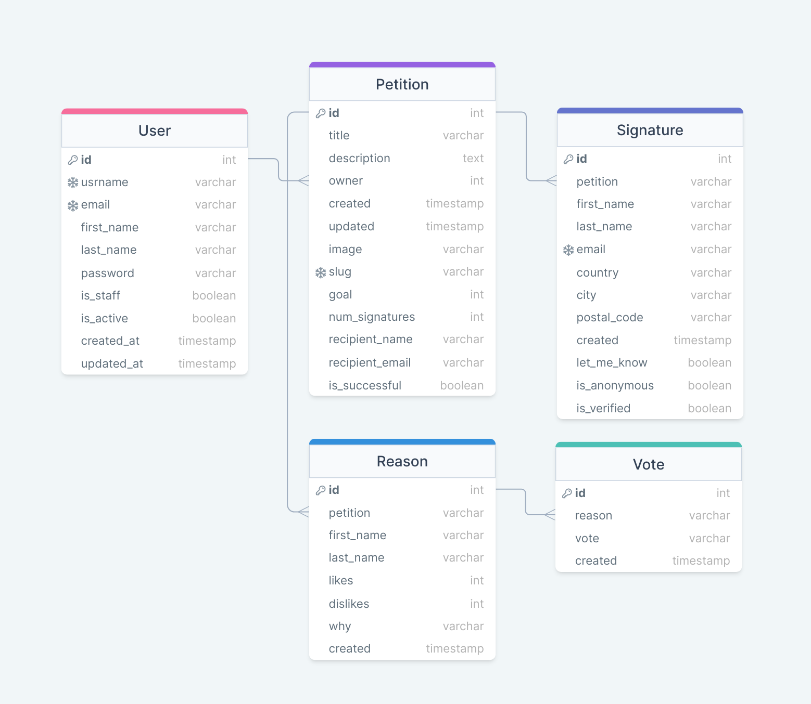

# plea
## Online Petition Platform API
[](https://www.codefactor.io/repository/github/everlookneversee/plea)


---

### Project dependencies:
Tech stack: Django, Django RestFramework, Celery, Celery Beat, Redis, PostgreSQL, Docker  
[Project dependencies full list](requirements.txt)

---

### Development team:
* Milad Sadeghi DM - EverLookNeverSee@GitHub
* [List of contributors](https://github.com/EverLookNeverSee/plea/graphs/contributors)

**This project is under active development.**

---

### Database models schema:



---

### Features based on database models:
**Note: Users do not need to register if they are just wanted to be a signer.**
* User:
  * User account registration
  * User activation using email
  * Resend user activation email
  * User info page which is accessible for user(not other users) and admin
  * Change password
  * Reset forgotten password
  * Basic authentication
  * Session authentication
  * Token authentication
  * JWT authentication
  * Delete account by user
  * Delete automatically inactive user accounts after one week by background processes

* Petition:
  * Creating petition by registered user(aka its owner)
  * Change petition title, description, image, slug and goal by its owner or admin user
  * Search petition by title, slug, description and owner
  * Petition goal: the number of signatures if it has been reached, petition will be considered as a successful one
  * Delete petition by its owner or admin user
  * Send email automatically to petition recipient about petition success
  * Send csv file attach to email to petition recipient that contains petition signers information
  * Send email to petition signers (let_me_know=True) about petition success
  * Using redis cache

* Signature:
  * Creating signature for a petition which is unverified by default
  * Each signature has a unique email address
  * Signature verification email
  * Resend signature verification email
  * let_me_know: If set to true, the system will email signer if the petition is successful
  * is_anonymous: if set to true, signer private information such as firstname, lastname and email won't be shown
  * Signature verification token will be expired after 3 hours
  * Delete automatically unverified signatures after one week by background processes
  * Using redis cache

* Reason:
  * Everyone can submit a reason for a petition(Why we need to sign this petition)
  * Using redis cache

* Vote:
  * Everyone could either like or dislike reasons that are submitted on a petition
  * Using redis cache

---

### Local run:
1. Clone the repository on your local machine:
```shell
git clone https://github.com/EverLookNeverSee/plea.git
```
2. Navigate to its root directory:
```shell
cd plea/
```
3. If you have installed redis server before on your local machine, stop it:
```shell
sudo /etc/init.d/redis-server stop
```
4. Running by docker compose:
```shell
docker-compose up --build
```
5. Make migrations, migrate and create superuser:
```shell
docker container exec -it plea_backend /bin/bash
python manage.py makemigrations
python manage.py migrate
python manage.py createsuperuser
exit
```
6. Add some fake data(user and petition) - Optional:
```shell
docker container exec -it plea_backend /bin/bash
python manage.py add_fake_petitions
exit 
```
7. Check out the project:
   1. API documentation: http://127.0.0.1:8000/swagger
   2. Smtp server for development: https://127.0.0.1:5000
   3. Admin panel: http://127.0.0.1:8000/admin

---

### License:
This project is licensed under [MIT License](LICENSE).
